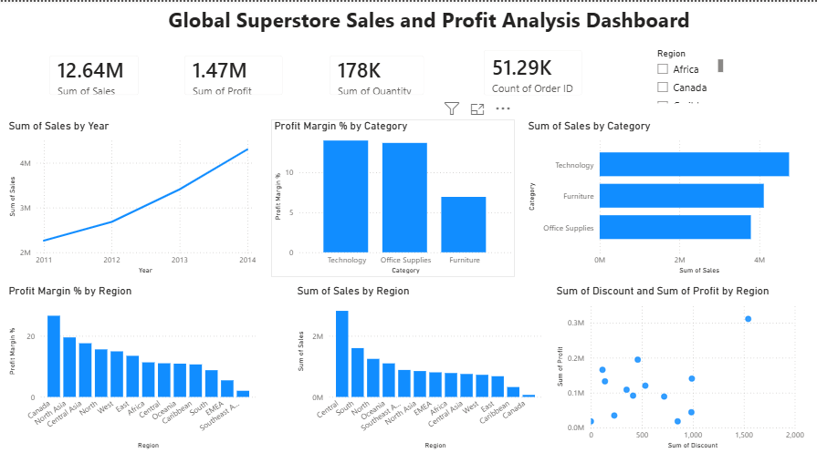
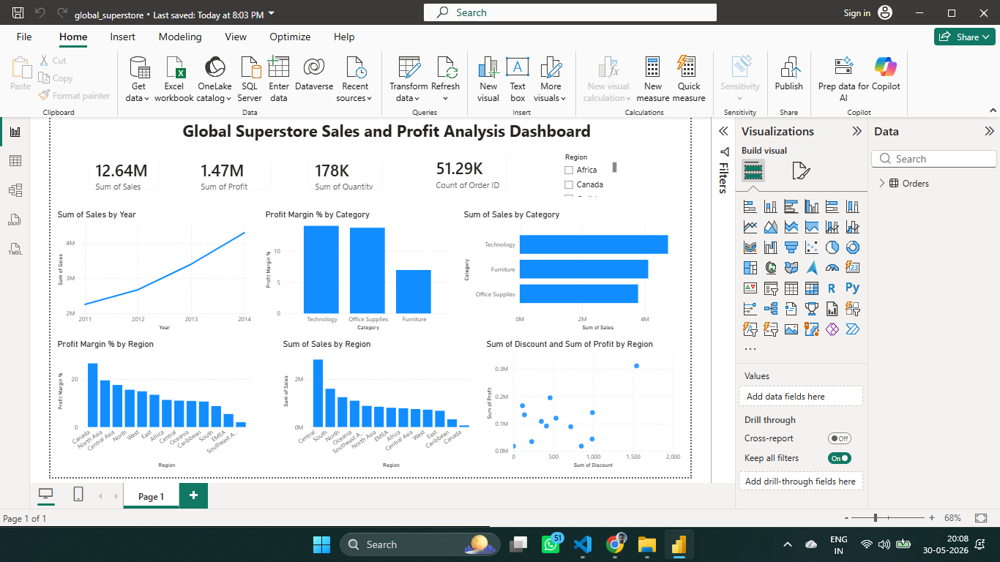

# Global Superstore Sales & Profit Analysis Dashboard

## Project Overview

This project analyzes the Global Superstore dataset using Power BI to uncover sales trends, profitability patterns, category performance, and regional business insights.

The dashboard provides an interactive view of key business metrics and helps identify high-performing categories, profitable regions, and the relationship between discounts and profits.

## Dataset Information

The dataset contains information related to:

- Orders
- Sales
- Profit
- Quantity
- Discount
- Category and Sub-Category
- Customer Details
- Regional Information
- Order Dates

## Tools Used

- Power BI
- Microsoft Excel (.xls dataset)

## Key Performance Indicators (KPIs)

The dashboard tracks:

- Total Sales
- Total Profit
- Total Quantity Sold
- Total Orders

## Dashboard Features

### Sales Trend Analysis

Analyzes yearly sales performance to identify business growth over time.

### Category Performance Analysis

Compares sales and profit margin across product categories.

### Regional Analysis

Evaluates sales and profitability across different regions.

### Discount vs Profit Analysis

Examines how discounts impact profitability across regions.

### Interactive Filtering

Region slicer allows users to filter the dashboard dynamically.

## Visualizations

- KPI Cards
- Line Chart (Sales by Year)
- Bar Chart (Sales by Category)
- Bar Chart (Profit Margin % by Category)
- Bar Chart (Sales by Region)
- Bar Chart (Profit Margin % by Region)
- Scatter Plot (Discount vs Profit by Region)
- Region Slicer

## Key Business Insights

- Total Sales reached 12.64M with a total Profit of 1.47M across 51K+ orders.
- Sales showed consistent growth from 2011 to 2014.
- Technology generated the highest sales among all product categories.
- Technology and Office Supplies achieved higher profit margins than Furniture.
- Central region generated the highest sales revenue.
- Canada achieved the highest profit margin percentage despite lower sales volume.
- High sales do not always guarantee high profitability.
- Profitability should be evaluated relative to sales using profit margin percentage.
- Higher discounts do not always result in higher profits.

## Dashboard Preview




## Project Structure

```text
Global-Superstore-PowerBI-Dashboard/
│
├── data/
│   └── Global_Superstore.xls
│
├── images/
│   └── dashboard.png
│
├── Global_Superstore_Dashboard.pbix
│
└── README.md
```

## Conclusion

This dashboard demonstrates how Power BI can be used to transform raw business data into actionable insights through data visualization, KPI tracking, and interactive analysis.